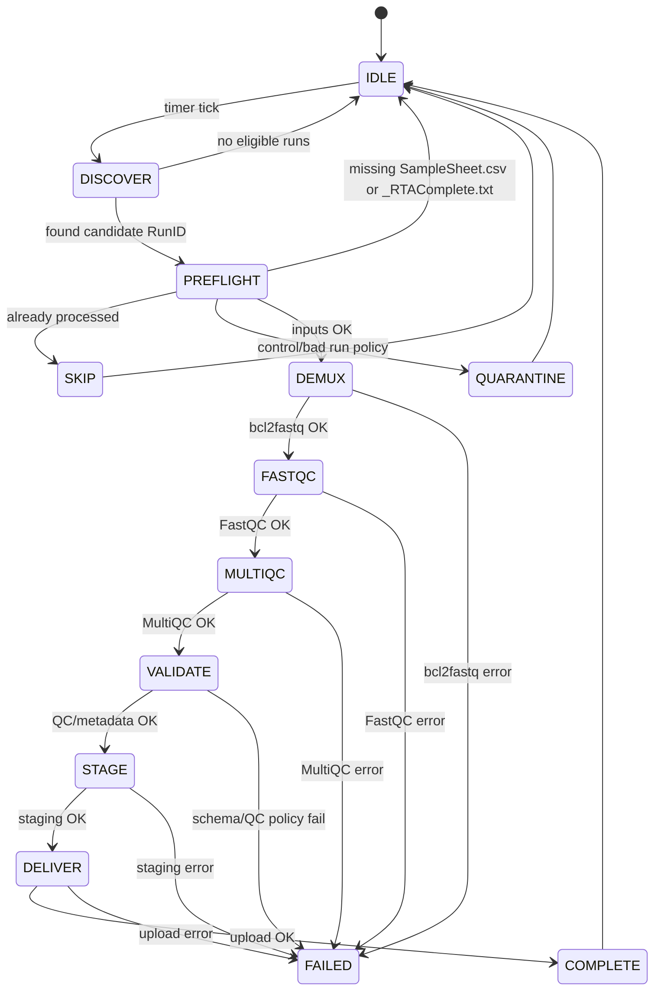

# nvi-demux

Internal Technical Design Document

## 1. Purpose

nvi-demux is an operational demultiplexing and quality-control pipeline for Illumina MiSeq and NextSeq sequencing runs at the Norwegian Veterinary Institute.

It performs:

* BCL to FASTQ conversion (bcl2fastq)
* Per-sample quality control (FastQC)
* Aggregated QC reporting (MultiQC)
* Deterministic staging for downstream delivery
* Controlled delivery to:

  * VIGASP (analysis)
  * NIRD (archival storage)

The system is designed to:

* Be operationally deterministic
* Be idempotent per RunID
* Surface sequencing quality and operational issues
* Minimize user intervention

---

## 2. Definitions

### RunID

A RunID is the Illumina-designated run directory name, e.g.:

`190912_M06578_0001_000000000-CNNTP`

Format:

`yymmdd_MACHINE-SERIAL_AUTOINCREMENT_000000000-FlowcellID`

RunID is treated as an opaque identifier and is not parsed, validated or rewritten.

---

## 3. System Boundaries

### Inputs

* `/data/rawdata/<RunID>/`
* Must contain:

  * `RTAComplete.txt`
  * `SampleSheet.csv`
  * Raw BCL data

### Outputs

* `/data/demultiplex/<RunID>/`
* `/data/for_transfer/<RunID>/`
* Logs under `/data/logs/<RunID>`

### External Dependencies

* Python >= 3.11
* bcl2fastq
* FastQC
* MultiQC
* Network connectivity (for delivery stage)
* paramiko, scp, sample-sheet, psutil, termcolor python libraries

---

## 4. Directory Architecture (seqtech00)

    ├── bin                                                         binaries and symlinks of binaries live here
    ├── clarity                                                     exported Illumina Clarity directory
    │   ├── gls_events  
    │   ├── logs                                                    clarity logs go here
    │   ├── miseq                                                   miseq-clarity stopover directory
    │   │   ├── M06578                                              per serial number
    │   │   │   └── samplesheets                                    samplesheets for this serial number go here
    │   │   └── M09180                                              other serial number
    │   │       └── samplesheets                                    samplesheets for other serial number go here
    │   └── nextseq                                                 nextseq-clarity stopover directory
    │       └── NB552450                                            per serial number
    │           └── samplesheets                                    samplesheets for this serial number gohere
    ├── demultiplex                                                 demultiplexed data directory
    ├── for_transfer                                                data ready to be transfered over to NIRD or VIGASP
    ├── logs                                                        all demultiplexing logs go here
    ├── rawdata                                                     raw data directory, sequencers write here
    │   ├── bad_runs                                                runs which are bad or rejected
    │   └── control_runs                                            water/other control runs
    └── samplesheets                                                cumulative samplesheet backups

---

## 5. Execution Model

### Trigger

A systemd user timer runs every 20 minutes on the clock.

The pipeline starts if:

* `RTAComplete.txt` exists
* `SampleSheet.csv` exists
* Run has not already been fully processed

### Manual Execution

```bash
/usr/local/bin/demultiplex <RunID>
```

---

## 6. Execution Flow

systemd user timer
-> run discovery
-> bcl2fastq
-> FastQC
-> MultiQC
-> validation
-> staging in /data/for_transfer/<RunID>/
-> delivery to VIGASP or NIRD

---

## 7. Idempotency Model

The pipeline:

* Treats RunID as immutable
* Writes output into deterministic directories
* Avoids partial overwrite without explicit operator cleanup
* Can be manually re-run after operator cleanup

Re-run pattern:

```bash
rm -rf /data/demultiplex/<RunID>* /data/for_transfer/<RunID>* && /usr/local/bin/demultiplex <RunID>
```

---

## 8. Quality and Observability

nvi-demux is not only a file mover. It is a quality instrumentation layer because it evaluates sequencing quality, aggregates QC metrics, detects metadata inconsistencies and provides structured information to decide whether a run is acceptable or requires investigation.

It enables:

* Detection of abnormal sequencing runs
* Comparative QC analysis across runs
* Detection of SampleSheet schema drift
* Control-run classification
* Structured notification via Teams hooks

It was written to make operational issues largely invisible, so attention can be focused on biological interpretation and sequencing quality rather than infrastructure problems.

---

## 9. Operational Assumptions

* Sequencers write to `/data/rawdata/`
* Lab personnel place SampleSheet.csv inside the RunID directory
* The seqtech user owns execution
* Network delivery credentials are available at runtime

---

## 10. Explicitly out of scope

* Continuous or real-time processing of sequencing data during instrument runtime; runs are processed only after completion.
    * Large clinical genomics labs and high-throughput core facilities sometimes implement near-real-time monitoring of sequencing metrics during instrument runtime. This is not one of our goals
* Interactive operator workflow: the system is not designed for manual step-by-step execution, user prompts, or guided intervention during processing; it runs non-interactively and deterministically.
* Replacement for LIMS
* General-purpose workflow engine: the system is not intended to execute arbitrary analysis pipelines or manage complex dependency graphs; it performs a fixed, domain-specific sequencing workflow.

This overview is included to clarify our current maturity level and to define the direction of future development:

    **Integration depth**

    * Manual handoff: FASTQ copied by staff, QC reviewed locally
    * Semi-integrated: LIMS exports SampleSheet, pipeline auto-triggers, results notified by email/teams <- WE ARE PARTIALLY HERE
    * Fully integrated: LIMS <-> pipeline API, automatic metadata validation, automatic delivery to analysis and archive <- WE ARE PARTIALLY HERE

    **Validation strictness**

    * Minimal: only check that files exist
    * Basic QC: FastQC/MultiQC review, manual interpretation <- WE ARE HERE
    * Policy-driven: numeric QC thresholds, automatic rejection/flagging
    * Longitudinal: compare against historical runs, detect drift

    **Automation level**

    * Manual start per run 
    * Cron/timer polling <- WE ARE HERE
    * Event-driven (filesystem triggers)
    * Fully orchestrated with retries, locking and structured notifications


---

## 11. Failure Modes

Failure classes:

* Input missing (no SampleSheet, no RTAComplete)
* bcl2fastq failure
* QC tool failure
* Transfer failure
* SampleSheet schema validation failure

Each failure must:

* Log deterministically
* Exit non-zero
* Not corrupt prior completed runs

---

## 12. Design Intent

The system is engineered to:

* Eliminate operational fragility
* Reduce manual intervention
* Surface biological and sequencing quality questions
* Provide long-term auditability

It is intended to become stable infrastructure that requires minimal maintenance once deployed.

---

## 13. State Machine Diagram



## 14. Invariants
